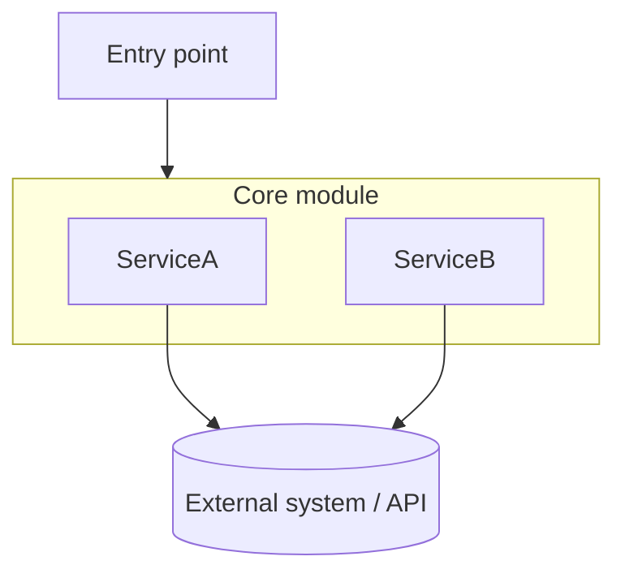

# Code conventions (all JS projects)

### JavaScript — modern JS only

Use ES2020+ everywhere — `const`/`let`, arrow functions, template literals, optional chaining (`?.`), nullish coalescing (`??`), `Array.includes()`, `element.remove()`. Never use `var` or old-style `function()` callbacks. Closure-capturing IIFEs (`(function(x){...})(x)`) are never needed — arrow functions in `forEach` close over `const`/`let` correctly.

### JSDoc — always on functions

Every function must have a JSDoc comment. Include `@param` and `@returns` tags with types. One-line description is enough; no need for verbose prose.

```js
/**
 * Fetches a Drive file and returns its base64-encoded content.
 * @param {string} fileId
 * @returns {{ type: string, data: string }|{ type: 'no-access' }}
 */
function getImageAsBase64(fileId) { ... }
```

# Playwright Tests (E2E only — no other test frameworks in use)

In projects that use Playwright:

After finishing Playwright test code, always ask the user if they want to actually run the test before proceeding.

When asked to fix a test, treat it as already broken — do not run it first. To understand the current UI state, use browser tools (take a screenshot, capture a DOM snapshot, or read the relevant component source code). Fix the test based on what you observe. Only ask the user for the test report if none of those approaches are sufficient to diagnose the issue.

# data-testid (front-end repos only)

In front-end projects that use `data-testid` attributes:

Use `data-testid` on interactive and key container elements to support automated testing.

**Naming**: always kebab-case, semantic (what the element IS or DOES, not implementation).

**Static IDs** — most common, use a plain string:

```tsx
<button data-testid="confirm-button" />
<div data-testid="cash-out-popup" />
```

**Dynamic labels** — use `toDataTestid` from `@sportsbook/utils-fe` to convert text (spaces → hyphens, lowercase):

```tsx
import { toDataTestid } from '@sportsbook/utils-fe';

<div data-testid={toDataTestid(name)} />
// Translation key suffix: strip namespace, then convert
<div data-testid={toDataTestid(text.split('::').at(-1))} />
```

**Compound IDs** — append a suffix to a base testid prop for sub-elements:

```tsx
// In a reusable component receiving dataTestid prop:
<div data-testid={dataTestid} />
<span data-testid={`${dataTestid}-label`} />
<ul data-testid={`${dataTestid}-options`} />
```

**State-based IDs** — reflect current state in the ID:

```tsx
<button data-testid={`${isExpanded ? 'collapse' : 'expand'}-button`} />
<div data-testid={`benefits-${isAllowed ? 'general' : 'suspicious'}-user`} />
```

**Tab pattern**:

```tsx
data-testid={`${tab.dataTestid ?? toDataTestid(tab.name)}-tab${isActive ? '-active' : ''}`}
```

**Suffix conventions**:

- Buttons: `-button` (e.g. `confirm-button`, `edit-button`)
- Links: `-link` (handled by `Link` component via `dataTestid` prop)
- Tabs: `-tab`, `-tab-active`
- Containers: no suffix (e.g. `betslip-tooltip`, `user-block`)
- Child elements: `{base}-{role}` (e.g. `slider-thumb`, `slider-min-value`)

**Prop name**: use `dataTestid` (camelCase) when passing as a component prop.

# CSS design system (front-end repos only)

When starting any new project with HTML/CSS, or touching a stylesheet for the first time, define shared primitives **before** writing one-off component rules. Retrofitting this after a stylesheet has grown (duplicated button/overlay rules, 2-3 near-identical accent colors) is real cleanup work — avoid the rework by setting it up from commit one.

**Tokens first**: declare `:root` CSS variables for every recurring value before styling components — colors (primary/accent, focus ring, danger, neutral border, at minimum) and a radius scale (usually one value is enough for small projects). Never hardcode a hex value that represents "the accent color" or "the danger color" — reference the variable. If a genuinely new semantic color is needed, add a new `--color-*` variable rather than inlining a hex value next to an existing similar one.

**Shared classes for repeated patterns**: the moment a button, overlay/modal, or input style is used twice, give it a class (`.btn-primary`, `.btn-secondary`, `.overlay`, etc.) instead of duplicating the rule block under a new ID or element selector. ID/element selectors should only carry what's *different* from the shared class (padding, size, position) — never re-declare color, border, or radius that the shared class already sets.

**One rule per interaction state**: decide once how disabled buttons, focused inputs, and hovered links look, and apply it with a single broad selector (e.g. `button:disabled { opacity: 0.5; cursor: default; }`, one focus-ring `box-shadow` reused on every text input) rather than repeating the same declaration per component ID.

**Before adding a new rule, check what already exists**: a duplicated rule block under a new ID is the main way a stylesheet drifts out of sync with itself — that's how a codebase ends up with three different "primary blue" hex values because each button was styled independently instead of reusing one.

# README conventions (software repos only)

When creating a new README, or adding/rewriting an "Architecture" section in an existing one, suggest including a Mermaid diagram of the codebase's architecture — don't just describe it in prose alone.

Pattern to follow:
- A short paragraph (2-4 sentences) naming the key modules/classes and how they call into each other.
- A fenced ` ```mermaid ` block, `graph TD`, showing those same modules as nodes and their calls/data flow as edges. Group related pieces with `subgraph`. Keep node labels short (use `\n` for a second line instead of long single-line labels).

Example shape:



# Git Commits
Always split changes logically into multiple commits when appropriate.
Group related changes together and use clear, descriptive commit messages.
Never bundle unrelated changes into a single commit.
Never commit or push automatically — only do so after a direct explicit command from the user.
