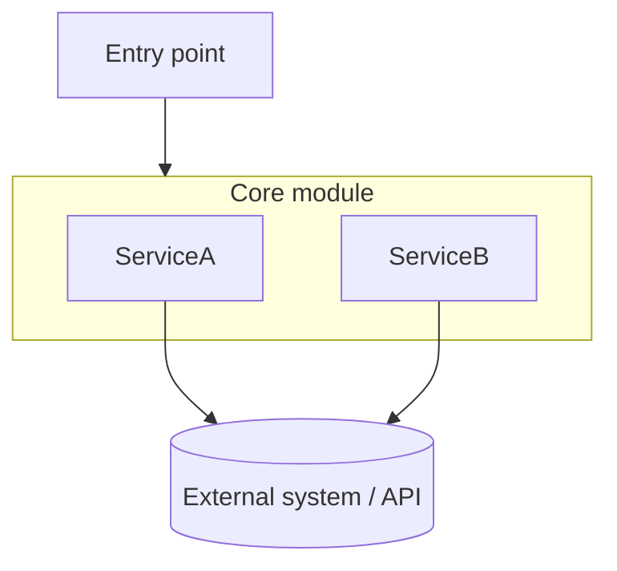

# Code conventions (all JS projects)

### JavaScript — modern JS only

Use ES2020+ everywhere — `const`/`let`, arrow functions, template literals, optional chaining (`?.`), nullish coalescing (`??`), `Array.includes()`, `element.remove()`. Never use `var` or old-style `function()` callbacks. Closure-capturing IIFEs (`(function(x){...})(x)`) are never needed — arrow functions in `forEach` close over `const`/`let` correctly.

### JSDoc — plain JS vs TypeScript

**Plain `.js` files** — every function must have a JSDoc comment with typed `@param` and `@returns` tags, since there's no other source of type information. One-line description is enough.

```js
/**
 * Fetches a Drive file and returns its base64-encoded content.
 * @param {string} fileId
 * @returns {{ type: string, data: string }|{ type: 'no-access' }}
 */
function getImageAsBase64(fileId) { ... }
```

**TypeScript (`.ts`/`.tsx`)** — JSDoc is added only when the signature leaves a real question unanswered: intent, a non-obvious invariant, a gotcha, or a usage example. No `@param`/`@returns` type annotations — TS already owns that. Skip JSDoc entirely when the name + signature are self-explanatory. Litmus test: if hovering the function in an IDE still leaves you wondering "why does this work this way," add one or two sentences; otherwise don't.

**Keeping JSDoc in sync** — whenever a function's signature or behavior changes, updating its JSDoc is mandatory, not optional. This includes: added/removed/renamed parameters, changed types, changed return value, or a changed description of what it does. Never leave a stale JSDoc comment describing the old behavior.

# Playwright Tests (E2E only — no other test frameworks in use)

In projects that use Playwright:

After finishing Playwright test code, always ask the user if they want to actually run the test before proceeding.

When asked to fix a test, treat it as already broken — do not run it first. To understand the current UI state, use browser tools (take a screenshot, capture a DOM snapshot, or read the relevant component source code). Fix the test based on what you observe. Only ask the user for the test report if none of those approaches are sufficient to diagnose the issue.

# data-testid (front-end repos only)

In front-end projects that use `data-testid` attributes, follow the naming and structure conventions in [docs/data-testid.md](docs/data-testid.md).

# CSS design system (front-end repos only)

When starting any new project with HTML/CSS, or touching a stylesheet for the first time, define shared primitives **before** writing one-off component rules. Retrofitting this after a stylesheet has grown (duplicated button/overlay rules, 2-3 near-identical accent colors) is real cleanup work — avoid the rework by setting it up from commit one.

**Tokens first**: declare `:root` CSS variables for every recurring value before styling components — colors (primary/accent, focus ring, danger, neutral border, at minimum) and a radius scale (usually one value is enough for small projects). Never hardcode a hex value that represents "the accent color" or "the danger color" — reference the variable. If a genuinely new semantic color is needed, add a new `--color-*` variable rather than inlining a hex value next to an existing similar one.

**Shared classes for repeated patterns**: the moment a button, overlay/modal, or input style is used twice, give it a class (`.btn-primary`, `.btn-secondary`, `.overlay`, etc.) instead of duplicating the rule block under a new ID or element selector. ID/element selectors should only carry what's *different* from the shared class (padding, size, position) — never re-declare color, border, or radius that the shared class already sets.

**One rule per interaction state**: decide once how disabled buttons, focused inputs, and hovered links look, and apply it with a single broad selector (e.g. `button:disabled { opacity: 0.5; cursor: default; }`, one focus-ring `box-shadow` reused on every text input) rather than repeating the same declaration per component ID.

**Before adding a new rule, check what already exists**: a duplicated rule block under a new ID is the main way a stylesheet drifts out of sync with itself — that's how a codebase ends up with three different "primary blue" hex values because each button was styled independently instead of reusing one.

# Code duplication (all software projects)

**Before writing new code, check what already exists.** Search for functions, patterns, or constants that do the same thing. Three similar lines copy-pasted is worse than one named helper — each copy is a future bug waiting to diverge.

**Extract when a pattern appears twice.** The threshold is two: the second copy is the signal to extract, not the third. Name the helper after what it does, not where it's used.

**During development** — when adding code that resembles something nearby, stop and extract the shared logic into a helper before continuing.

**During review / refactoring** — when touching a file, note any patterns that appear more than once and flag them. If the scope of the task allows, extract them in the same PR; if not, mention them explicitly so they aren't forgotten.

**Configuration and magic values belong in one place.** Constants, regex patterns, type definitions, and tuning parameters should be declared once (in a config or constants file) and referenced everywhere. Never inline a value that appears — or could appear — in more than one location.

**The bar for extraction is low; the bar for a new abstraction is high.** A two-line helper that eliminates duplication is always worth it. A new layer of indirection that trades duplication for complexity is not — prefer a clear duplicate over a confusing abstraction.

# File size and splitting (all software projects)

Keep files scoped to one responsibility. If a file grows past roughly 300-400 lines **and** contains more than one clear responsibility (e.g. a service class plus its unrelated helpers, or a component plus unrelated utility functions), split it along that responsibility boundary into separate files.

Don't split a cohesive, single-purpose file just to hit a line count — a long file that does one thing well is better than several small files that only make sense read together. The trigger is mixed responsibilities, not length alone; length is just the signal to go look.

When splitting, name each new file after the responsibility it holds, not after the file it was extracted from.

# README conventions (all software projects)

When creating a new README, or adding/rewriting an "Architecture" section in an existing one, suggest including a Mermaid diagram of the codebase's architecture — don't just describe it in prose alone.

Pattern to follow:
- A short paragraph (2-4 sentences) naming the key modules/classes and how they call into each other.
- A fenced ` ```mermaid ` block, `graph TD`, showing those same modules as nodes and their calls/data flow as edges. Group related pieces with `subgraph`. Keep node labels short (use `\n` for a second line instead of long single-line labels).

Example shape:


```mermaid
graph TD
  Entry["Entry point"] --> Core

  subgraph Core["Core module"]
    ServiceA
    ServiceB
  end

  ServiceA --> Backend[("External system / API")]
  ServiceB --> Backend
```

**Before finalizing any Mermaid diagram, check every label for characters that collide with Mermaid's grammar** — this is a real recurring failure mode (parse errors from a mismatched shape-delimiter or a raw `(`/`>` inside a label), not a hypothetical one:
- **Never mix quoted and unquoted text in the same label.** `Journal[(".docx"\njournal source)]` is invalid — the parser reads `".docx"` as a complete quoted string, then chokes on the unquoted text still inside the shape delimiters. Wrap the *entire* label in one pair of double quotes: `Journal[(".docx\njournal source")]`.
- **Quote any edge label (`|...|`) that contains parentheses, brackets, or braces.** `-->|same render_extract()\nas the main pipeline|` fails because the unescaped `()` is read as a node-shape token even inside pipes. Fix: `-->|"same render_extract()\nas the main pipeline"|`.
- **Quote any edge label that starts with a bare `>` (or other arrow-like character) right after the opening pipe** — e.g. `|>1 match|` — since it collides with arrowhead tokens. Fix: reword or quote it, e.g. `|"more than 1 match"|`.
- **General rule**: if a label contains anything beyond plain words/digits/spaces/`\n` — parens, quotes, angle brackets — wrap that whole label in one pair of double quotes rather than leaving it bare or partially quoted.
- Do one final read-through of the rendered diagram (or at minimum re-scan every node/edge label against the rules above) before presenting it as done — don't assume a diagram that "looks right" parses correctly.

**Mermaid diagrams belong in README.md, not CLAUDE.md.** CLAUDE.md is read by Claude as text, not rendered — a diagram there is just parsed as syntax with no visual/spatial benefit, and it's redundant with the prose description already covering the same file/function relationships. Keep CLAUDE.md's architecture notes as prose; put the rendered diagram in the README, where it's actually useful, for human readers.

# After edits (all software projects)

After completing any code edits, check whether the changes affect the README or CLAUDE.md — update them if the architecture, conventions, or project setup have changed. Don't update them for routine bug fixes or small internal changes that don't affect how the project is used or understood.

If the project has no CLAUDE.md or no README, suggest adding one — don't add it unprompted.

If CLAUDE.md or README has grown large enough that a section would read better on its own (a lengthy convention writeup, detailed setup steps, etc.), suggest splitting it into a `/docs` directory and linking to it, rather than letting the root file keep growing.

When linking to a split-out doc from CLAUDE.md, choose the reference form deliberately: use `@docs/file.md` (Claude Code's import syntax) only for content that must always be in effect regardless of project type — it loads unconditionally into every session. Use a plain Markdown link (`[docs/file.md](docs/file.md)`) for conditionally-scoped content (e.g. "front-end repos only," "projects that use X") — Claude reads it on demand when the task is actually relevant, so unrelated projects don't pay for content they'll never use.

If a design or architecture choice keeps getting re-derived or re-litigated across sessions (e.g. re-explaining why a library was picked over an alternative, or why a pattern that looks wrong is actually intentional), record it as a short ADR in `docs/decisions/` (e.g. `docs/decisions/0003-use-x-over-y.md`: context, decision, consequences) instead of re-explaining it each time. Link to it from CLAUDE.md or the README with a plain Markdown link, not `@import`.

# Git Commits
Always split changes logically into multiple commits when appropriate.
Group related changes together and use clear, descriptive commit messages.
Never bundle unrelated changes into a single commit.
Never commit or push automatically — only do so after a direct explicit command from the user.

# Google Apps Script (clasp) projects

Never run `clasp push` (or any command that deploys/pushes code to Apps Script) unless the user gives a direct, explicit command to do so in that moment. Making the code change is fine — pushing it live is not, without asking first.

If a clasp project has no `@types/google-apps-script` dev dependency yet, suggest adding it (don't add it unprompted). It's dev-only tooling — nothing about it gets pushed to Apps Script or affects runtime — but it fixes false-positive editor diagnostics on Apps Script globals (`SpreadsheetApp`, `ScriptApp`, `PropertiesService`, event types like `GoogleAppsScript.Events.SheetsOnEdit`, etc.) and lets JSDoc `@param`/`@returns` types be checked against the real API shapes. Remember to add `node_modules`/`package.json`/`package-lock.json` to `.claspignore` when introducing it, so they aren't pushed alongside the script files.

# Working directory boundaries (all projects)

Never read, browse, or search files outside the current project's working directory — including other project folders elsewhere on disk (e.g. to borrow ideas, styling, or patterns) — unless the user has explicitly given permission and named the path in the current conversation. This applies even if it seems like it would produce a better or faster result. If outside context would genuinely help, ask the user first and name the specific path you want to look at.
