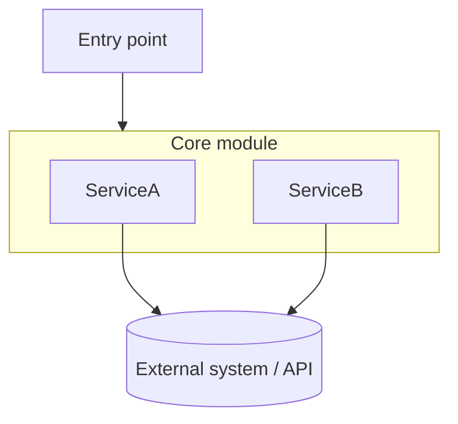

# README architecture diagrams (Mermaid)

When creating a new README, or adding/rewriting an "Architecture" section in an existing one, suggest including a Mermaid diagram of the codebase's architecture — don't just describe it in prose alone.

Pattern to follow:
- A short paragraph (2-4 sentences) naming the key modules/classes and how they call into each other.
- A fenced ` ```mermaid ` block, `graph TD`, showing those same modules as nodes and their calls/data flow as edges. Group related pieces with `subgraph`. Keep node labels short (use `\n` for a second line instead of long single-line labels).

Example shape:



**Before finalizing any Mermaid diagram, check every label for characters that collide with Mermaid's grammar** — this is a real recurring failure mode (parse errors from a mismatched shape-delimiter or a raw `(`/`>` inside a label), not a hypothetical one:
- **Never mix quoted and unquoted text in the same label.** `Journal[(".docx"\njournal source)]` is invalid — the parser reads `".docx"` as a complete quoted string, then chokes on the unquoted text still inside the shape delimiters. Wrap the *entire* label in one pair of double quotes: `Journal[(".docx\njournal source")]`.
- **Quote any edge label (`|...|`) that contains parentheses, brackets, or braces.** `-->|same render_extract()\nas the main pipeline|` fails because the unescaped `()` is read as a node-shape token even inside pipes. Fix: `-->|"same render_extract()\nas the main pipeline"|`.
- **Quote any edge label that starts with a bare `>` (or other arrow-like character) right after the opening pipe** — e.g. `|>1 match|` — since it collides with arrowhead tokens. Fix: reword or quote it, e.g. `|"more than 1 match"|`.
- **General rule**: if a label contains anything beyond plain words/digits/spaces/`\n` — parens, quotes, angle brackets — wrap that whole label in one pair of double quotes rather than leaving it bare or partially quoted.
- Do one final read-through of the rendered diagram (or at minimum re-scan every node/edge label against the rules above) before presenting it as done — don't assume a diagram that "looks right" parses correctly.

**Mermaid diagrams belong in README.md, not CLAUDE.md.** CLAUDE.md is read by Claude as text, not rendered — a diagram there is just parsed as syntax with no visual/spatial benefit, and it's redundant with the prose description already covering the same file/function relationships. Keep CLAUDE.md's architecture notes as prose; put the rendered diagram in the README, where it's actually useful, for human readers.
