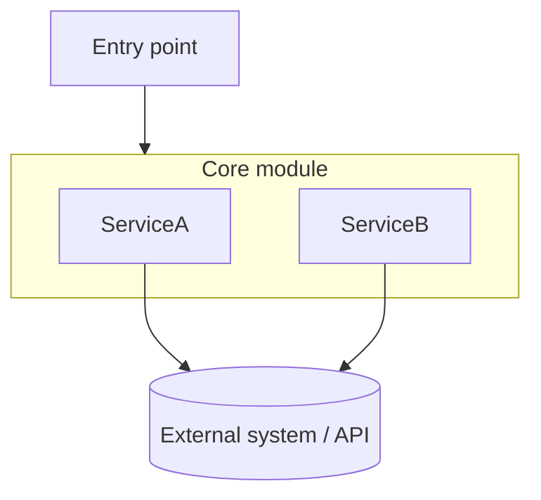
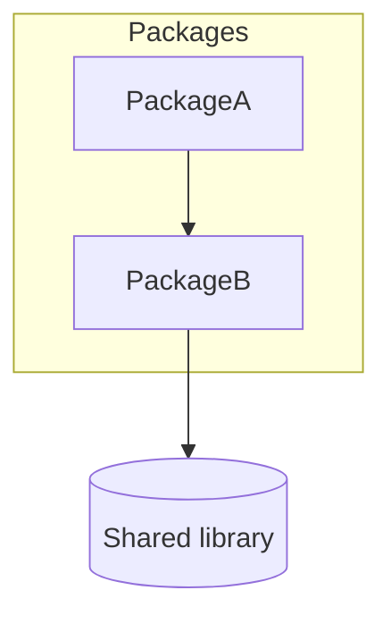

# README.md Templates

## Key Principles

- **Reader-first**: written for a human seeing the project for the first time, not for Claude's context window
- **Actionable**: install/run commands should be copy-paste ready and verified against the real repo
- **Current**: everything should reflect the actual codebase state
- **Diagram the architecture**: for any project with more than one real module/service, pair the Architecture prose with a Mermaid `graph TD` diagram

---

## Recommended Sections

Use only the sections relevant to the project. Not all sections are needed.

### Title + Description

```markdown
# <Project Name>

<One-line description of what it is and why it exists>
```

### Getting Started

```markdown
## Getting Started

### Prerequisites

- <runtime/tool + version>

### Install

```bash
<install command>
```

### Run

```bash
<run command>   # <what happens, e.g. "starts dev server on :3000">
```
```

### Usage

```markdown
## Usage

```<language>
<realistic example showing the primary use case>
```
```

### Architecture

For any project with real internal structure — more than one module, service, or clear data flow — pair prose with a diagram:

```markdown
## Architecture

<2-4 sentence paragraph naming the key modules/classes and how they call into each other>


```

Keep node labels short — use `\n` for a second line instead of one long label. Group related pieces with `subgraph`.

For a single-file script or trivial project, skip the diagram — a one-line description is enough:

```markdown
## Architecture

A single script (`main.py`) that reads CSV input and writes JSON output — no internal modules to diagram.
```

### Configuration

```markdown
## Configuration

| Variable | Required | Purpose |
|----------|----------|---------|
| `<VAR_NAME>` | Yes/No | <purpose, default if any> |
```

### Development / Contributing

```markdown
## Development

```bash
<test command>
<lint command>
```

<branch/PR conventions if any>
```

### License

```markdown
## License

<License name> — see [LICENSE](LICENSE)
```

---

## Template: Minimal Project

```markdown
# <Project Name>

<One-line description>

## Getting Started

```bash
<install command>
<run command>
```

## Usage

```<language>
<example>
```

## License

<License>
```

---

## Template: Comprehensive Project

```markdown
# <Project Name>

<One-line description>

## Getting Started

### Prerequisites

- <requirement>

### Install

```bash
<install command>
```

### Run

```bash
<run command>
```

## Usage

```<language>
<example>
```

## Architecture

<2-4 sentence paragraph>

```mermaid
graph TD
  <nodes and edges>
```

## Configuration

| Variable | Required | Purpose |
|----------|----------|---------|
| `<VAR>` | Yes | <purpose> |

## Development

```bash
<test command>
<lint command>
```

## License

<License>
```

---

## Template: Library / Package

```markdown
# <Package Name>

<One-line description of what it does>

## Install

```bash
<install command>
```

## Usage

```<language>
<import/usage example>
```

## API

- `<export>` — <purpose>

## License

<License>
```

---

## Template: Monorepo Root

```markdown
# <Monorepo Name>

<Description>

## Packages

| Package | Description | Path |
|---------|-------------|------|
| `<name>` | <purpose> | `<path>` |

## Getting Started

```bash
<install command>
```

## Architecture

<2-4 sentence paragraph on how packages relate>



## Development

```bash
<test command>
```
```

---

## Template: Slim README with a docs/ index

Use when a README has been (or is being) split — see [splitting-guidelines.md](splitting-guidelines.md). The README stays the entry point; reference lives in `docs/`.

```markdown
# <Project Name>

<One-line description>

To set it up, see [Getting started](#getting-started). Detailed reference (<topics>) is under [Documentation](#documentation).

## How it works

<2-4 sentence paragraph + Mermaid diagram + file table>

## Features

- **<Feature>** — <one line>
- **<Feature>** — <one line>

See [Features](docs/features.md) for the details.

## Getting started

<Prerequisites, install, create any git-ignored config, run>

## Development

<check/lint/typecheck commands from package.json>

## Documentation

- [<Topic>](docs/<topic>.md) — <what's in it>
- Contributors: [<internals>](docs/architecture-<x>.md)
```

Each new docs file starts with a `# Title`, a one-line intro, and `Back to the [README](../README.md)`; moved `##`/`###` headings keep their levels.

---

## Update Principles

When updating any README.md:

1. **Be specific**: use actual file paths, real commands from this project — verify, don't assume
2. **Be current**: cross-check info against the actual codebase before writing it
3. **Be welcoming**: a README can afford friendlier, more explanatory prose than CLAUDE.md
4. **Diagram real structure**: add a Mermaid `graph TD` to the Architecture section for any multi-module/service project; skip it for trivial single-file projects
5. **Preserve what works**: don't overwrite an existing README's structure, badges, or tone wholesale — make targeted additions
