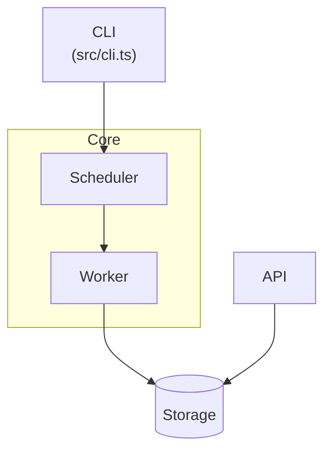

# README.md Update Guidelines

## Core Principle

A README is written for **people**, not for Claude's context window. Unlike CLAUDE.md, some friendliness and redundancy with the code is fine — the goal is "a stranger can get this running and understand it," not token efficiency. Still verify every fact against the actual repo before writing it down.

## What TO Add

### 1. Missing or Broken Getting-Started Steps

```markdown
## Getting Started

```bash
npm install
cp .env.example .env   # fill in API_KEY
npm run dev             # http://localhost:3000
```
```

Why: Lets a new clone actually run without spelunking through `package.json`.

### 2. A Concrete Usage Example

```markdown
## Usage

```js
import { fetchWidget } from "widget-lib";

const widget = await fetchWidget("abc123");
console.log(widget.name); // "Blue Widget"
```
```

Why: Shows the thing working, not just how to install it.

### 3. Architecture Prose + Mermaid Diagram

For a project with more than one real module/service, add a short paragraph naming the key pieces and how they call into each other, followed by a diagram of the same relationship:

```markdown
## Architecture

The CLI (`src/cli.ts`) parses commands and calls into the `Scheduler`, which
dispatches jobs to `Worker` instances. Workers write results to `Storage`,
which the API layer reads back for status queries.


```

Why: this is a standing convention for this user's projects (see their global CLAUDE.md README guidance) — a rendered diagram is more useful to a human reader than prose alone, and belongs in README.md specifically (not CLAUDE.md, which isn't rendered).

Only add this when the project actually has multiple interacting pieces — don't diagram a single-file script.

### 4. Required Configuration

```markdown
## Configuration

| Variable | Required | Purpose |
|----------|----------|---------|
| `API_KEY` | Yes | Auth for the upstream service |
| `PORT` | No (default 3000) | Server port |
```

Why: Undocumented required config is the #1 cause of "it doesn't work for me."

### 5. Dev Workflow / Contributing

```markdown
## Development

```bash
npm test        # run test suite
npm run lint     # check style
```

PRs welcome — please include a test for any behavior change.
```

Why: Establishes the expected loop for anyone touching the code.

### 6. A Setup Path That Actually Closes

If a required file is git-ignored (`.env`, `.clasp.json`, a targets list), show how to create it and give its minimal contents, plus any setting that silently changes behavior when missing (e.g. clasp's `"rootDir"`). List external tools scripts need (`jq`, …) under Prerequisites. Use current command names for the installed CLI version.

```markdown
Create `.clasp.json` in the repo root (it's git-ignored):

{ "scriptId": "<script-id>", "rootDir": "src" }
```

### 7. Every Check Script in Development

Read `package.json` scripts / `Makefile` and list each check/lint/typecheck command with one clause on what it catches; say plainly if there is no test suite or build step.

### 8. A Split for an Oversized README

When the README is 250+ lines with a reference half, propose moving that half to new user-facing `docs/*.md` files, leaving a short Features overview and a Documentation index behind. Method, what stays, and the verification step: [splitting-guidelines.md](splitting-guidelines.md).

## What NOT to Add

### 1. Restating the Obvious from the Code

Bad:
```markdown
This project has a `src` folder containing the source code.
```

### 2. Generic Boilerplate

Bad:
```markdown
## Contributing

Contributions are welcome! Please read our contributing guidelines.
```
...when no actual guidelines or process exist. Either write the real process or omit the section.

### 3. Diagramming Trivial Structure

Bad: a Mermaid diagram for a project that's a single script with no internal modules. Diagrams earn their place when there's a real relationship to show.

### 4. Unverified Commands or Paths

Never write a command into the README without checking it's real (matches an actual `package.json` script, `Makefile` target, etc.) and never reference a file path without confirming it exists.

### 5. Stale Info Left "Just in Case"

If a section describes a feature/stack that's been removed, remove or update it — don't leave it "for reference."

### 6. Retyping Moved Content

When splitting, move sections verbatim by line range; never rewrite them "while you're at it" — it makes the move unreviewable and can silently drop detail. Wording fixes are separate, shown diffs.

### 7. Pouring User Reference into Contributor Docs

Don't merge README reference material into `docs/architecture-*.md` (or similar contributor/agent docs linked from CLAUDE.md). Create separate user-facing files.

### 8. Creating Files the User Should Decide On

Don't add a `LICENSE`, CI config, or hooks. Flag a declared-but-missing license; suggest the rest.

## Diff Format for Updates

### 1. Identify the File

```
File: ./README.md
Section: Getting Started (new section after title/description)
```

### 2. Show the Change

```diff
 # Widget Service

 A small service for managing widgets.

+## Getting Started
+
+```bash
+npm install
+npm run dev
+```
+
 ## Architecture
 ...
```

### 3. Explain Why

> **Why this helps:** No install/run steps were documented — a new clone
> couldn't get started without reading `package.json` scripts directly.

## Validation Checklist

Before finalizing an update, verify:

- [ ] Every command was checked against the actual project files (not assumed)
- [ ] Every file path/link referenced actually exists
- [ ] Architecture section for a multi-module project includes a Mermaid diagram
- [ ] No boilerplate or placeholder text left in
- [ ] Existing tone/structure/sections (badges, sponsors, etc.) preserved, not overwritten wholesale
- [ ] Would a first-time reader actually be able to get this running from what's written?
- [ ] `scripts/check_md_links.py` reports 0 broken links/anchors (and, after a split, only deliberately reworded lines are "not found")
- [ ] No changelog-style wording ("now", "previously") in text you added or touched
- [ ] After a split: README keeps a Features overview and a Documentation index; a CLAUDE.md pointer was proposed if CLAUDE.md maps the docs
